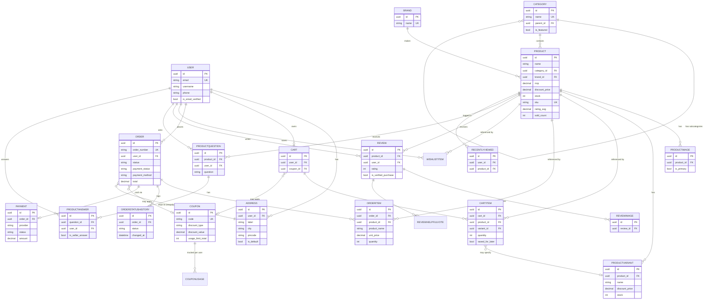

# FreshMart — Entity Relationship Diagram

Rendered with [Mermaid](https://mermaid.js.org) — paste into any Mermaid-compatible viewer (GitHub renders it natively).

```mermaid
erDiagram
    USER ||--o{ ADDRESS : has
    USER ||--o| CART : owns
    USER ||--o{ ORDER : places
    USER ||--o{ WISHLISTITEM : saves
    USER ||--o{ REVIEW : writes
    USER ||--o{ PRODUCTQUESTION : asks
    USER ||--o{ PRODUCTANSWER : answers

    CATEGORY ||--o{ CATEGORY : "has subcategories"
    CATEGORY ||--o{ PRODUCT : contains
    BRAND ||--o{ PRODUCT : makes

    PRODUCT ||--o{ PRODUCTIMAGE : has
    PRODUCT ||--o{ PRODUCTVARIANT : has
    PRODUCT ||--o{ CARTITEM : "referenced by"
    PRODUCT ||--o{ ORDERITEM : "referenced by"
    PRODUCT ||--o{ WISHLISTITEM : "referenced by"
    PRODUCT ||--o{ REVIEW : receives
    PRODUCT ||--o{ PRODUCTQUESTION : receives
    PRODUCT ||--o{ RECENTLYVIEWED : "logged in"

    CART ||--o{ CARTITEM : contains
    CART }o--o| COUPON : "may apply"
    CARTITEM }o--o| PRODUCTVARIANT : "may specify"

    ORDER ||--o{ ORDERITEM : contains
    ORDER ||--o{ ORDERSTATUSHISTORY : logs
    ORDER ||--o| PAYMENT : "paid via"
    ORDER }o--o| COUPON : "may apply"
    ORDER }o--|| ADDRESS : "ships to (snapshot)"

    REVIEW ||--o{ REVIEWIMAGE : has
    REVIEW ||--o{ REVIEWHELPFULVOTE : receives
    PRODUCTQUESTION ||--o{ PRODUCTANSWER : has

    COUPON ||--o{ COUPONUSAGE : "tracked per user"

    USER {
        uuid id PK
        string email UK
        string username
        string phone
        bool is_email_verified
    }
    ADDRESS {
        uuid id PK
        uuid user_id FK
        string label
        string city
        string pincode
        bool is_default
    }
    CATEGORY {
        uuid id PK
        string name UK
        uuid parent_id FK
        bool is_featured
    }
    BRAND {
        uuid id PK
        string name UK
    }
    PRODUCT {
        uuid id PK
        string name
        uuid category_id FK
        uuid brand_id FK
        decimal mrp
        decimal discount_price
        int stock
        string sku UK
        decimal rating_avg
        int sold_count
    }
    PRODUCTIMAGE {
        uuid id PK
        uuid product_id FK
        bool is_primary
    }
    PRODUCTVARIANT {
        uuid id PK
        uuid product_id FK
        string name
        decimal discount_price
        int stock
    }
    CART {
        uuid id PK
        uuid user_id FK
        uuid coupon_id FK
    }
    CARTITEM {
        uuid id PK
        uuid cart_id FK
        uuid product_id FK
        uuid variant_id FK
        int quantity
        bool saved_for_later
    }
    COUPON {
        uuid id PK
        string code UK
        string discount_type
        decimal discount_value
        int usage_limit_total
    }
    ORDER {
        uuid id PK
        string order_number UK
        uuid user_id FK
        string status
        string payment_status
        string payment_method
        decimal total
    }
    ORDERITEM {
        uuid id PK
        uuid order_id FK
        uuid product_id FK
        string product_name
        decimal unit_price
        int quantity
    }
    ORDERSTATUSHISTORY {
        uuid id PK
        uuid order_id FK
        string status
        datetime changed_at
    }
    PAYMENT {
        uuid id PK
        uuid order_id FK
        string provider
        string status
        decimal amount
    }
    REVIEW {
        uuid id PK
        uuid product_id FK
        uuid user_id FK
        int rating
        bool is_verified_purchase
    }
    REVIEWIMAGE {
        uuid id PK
        uuid review_id FK
    }
    PRODUCTQUESTION {
        uuid id PK
        uuid product_id FK
        uuid user_id FK
        string question
    }
    PRODUCTANSWER {
        uuid id PK
        uuid question_id FK
        uuid user_id FK
        bool is_seller_answer
    }
    RECENTLYVIEWED {
        uuid id PK
        uuid user_id FK
        uuid product_id FK
    }
```
